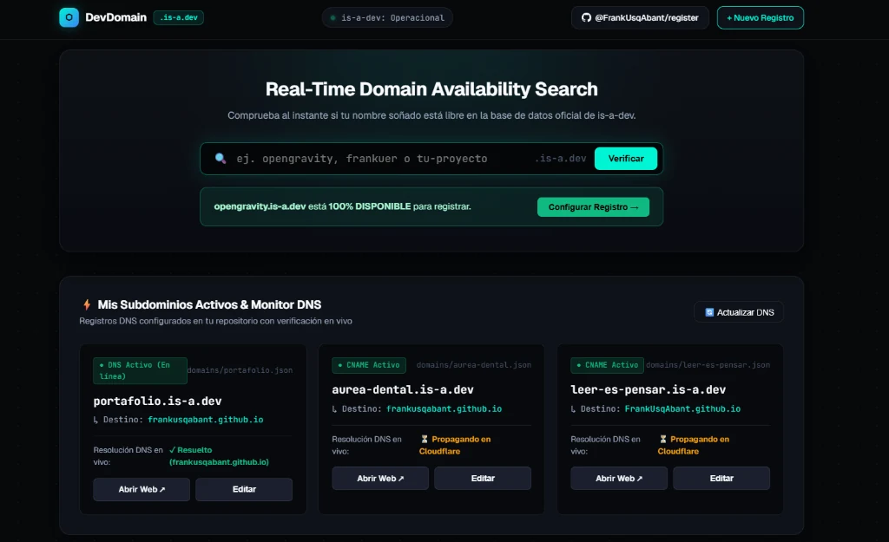

# 🌐 DevDomain Studio — Gestor Personal de Subdominios `.is-a.dev`

> **Panel de control Obsidian Cyberpunk para verificar disponibilidad en tiempo real, monitorear resolución DNS y generar solicitudes de subdominios `.is-a.dev` con selector universal de repositorios.**

---

  
   
  👆 <i>Haz clic en la imagen o en el badge superior para abrir la aplicación web en vivo</i>

---

## ⚡ Características Principales

- 🔍 **Buscador en Tiempo Real:** Comprueba disponibilidad consultando directamente la base de datos oficial de `is-a.dev`. Tú eliges si deseas adoptarlo con un clic.
- 📡 **Monitor DNS en Vivo:** Diagnostica la resolución y propagación de tus subdominios mediante Google Public DNS over HTTPS.
- 📂 **Selector Universal de Repositorios:** Explora proyectos públicos de **cualquier usuario u organización de GitHub** (o restablece a `@FrankUsqAbant`) con filtro de búsqueda en vivo.
- ⚡ **Control Total & Automatización al Elegir:** Al hacer clic en *"Elegir este Repositorio"*, se autoconfigura de inmediato el CNAME canónico, el subdominio y el código JSON oficial.
- 🛡️ **Seguridad & Sanitización:** Mitigación total de XSS mediante escape de entidades HTML, validación RFC de nombres de host y cero exposición de credenciales.
- ⚙️ **DNS Studio & Terminal:** Soporte para registros `CNAME`, `A`, `URL (301)` y `TXT` con copia de JSON al portapapeles y enlace directo para crear el Pull Request oficial.

---

## 📁 Subdominios Activos en este Repositorio

| Subdominio | Archivo | Registro | Destino | Estado |
| :--- | :---: | :---: | :--- | :---: |
| **`portafolio.is-a.dev`** | [`domains/portafolio.json`](./domains/portafolio.json) | `CNAME` | `frankusqabant.github.io` | 🟢 Activo |
| **`aurea-dental.is-a.dev`** | [`domains/aurea-dental.json`](./domains/aurea-dental.json) | `CNAME` | `frankusqabant.github.io` | 🟢 Activo |
| **`leer-es-pensar.is-a.dev`** | [`domains/leer-es-pensar.json`](./domains/leer-es-pensar.json) | `CNAME` | `FrankUsqAbant.github.io` | 🟢 Activo |

---

## 🚀 Acceso a la Aplicación

👉 **[https://frankusqabant.github.io/register/](https://frankusqabant.github.io/register/)**
